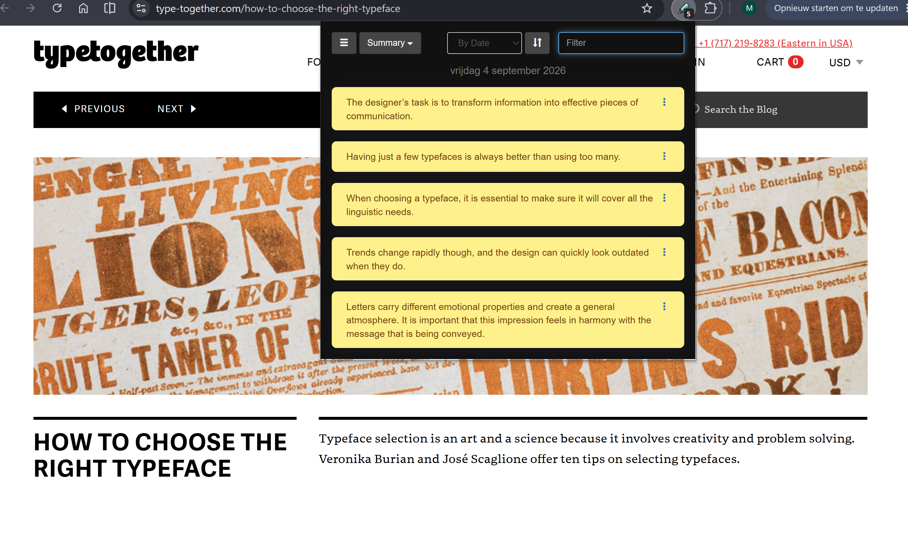
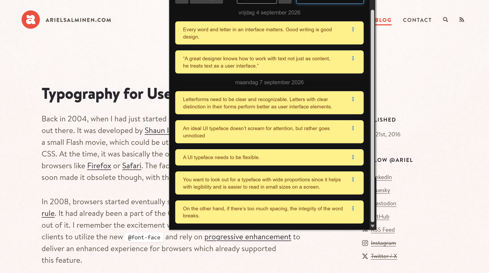
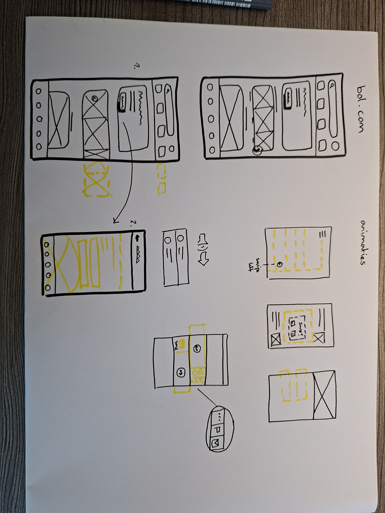
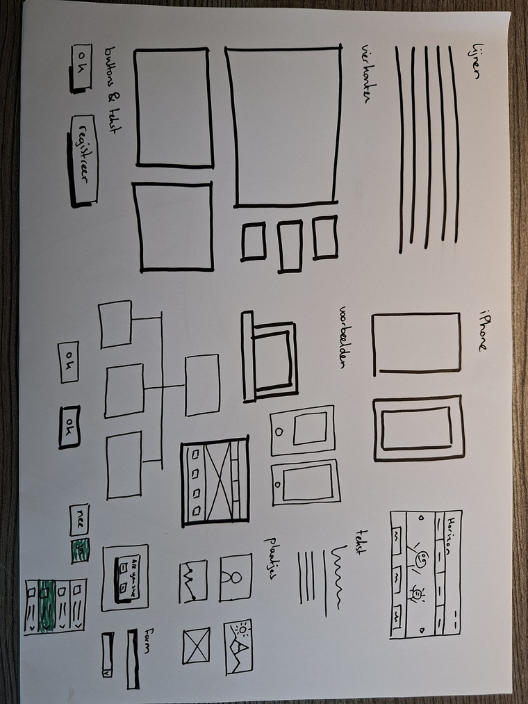
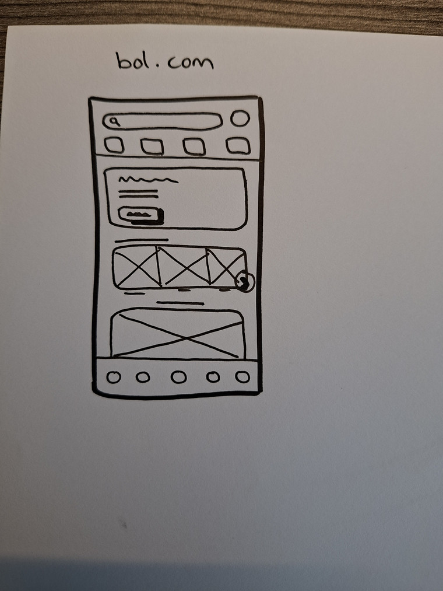
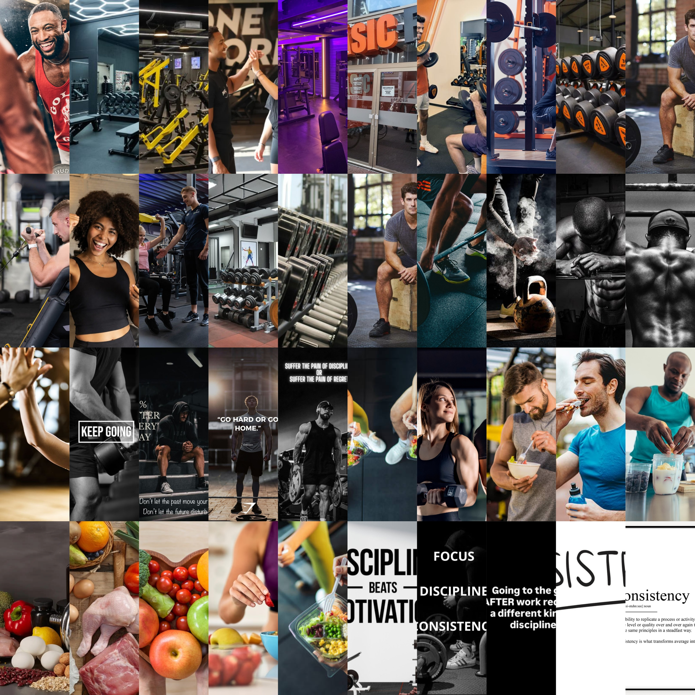
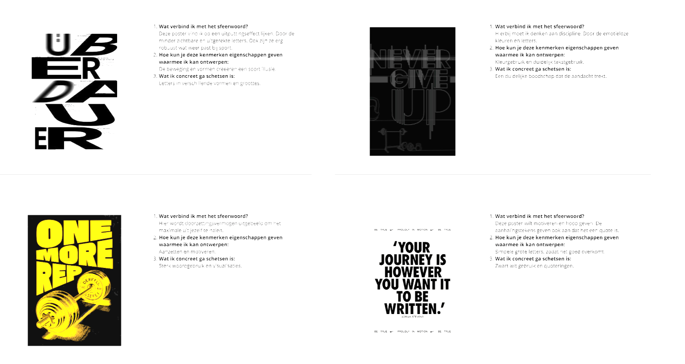
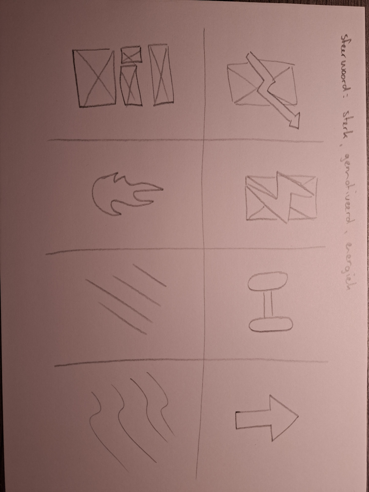
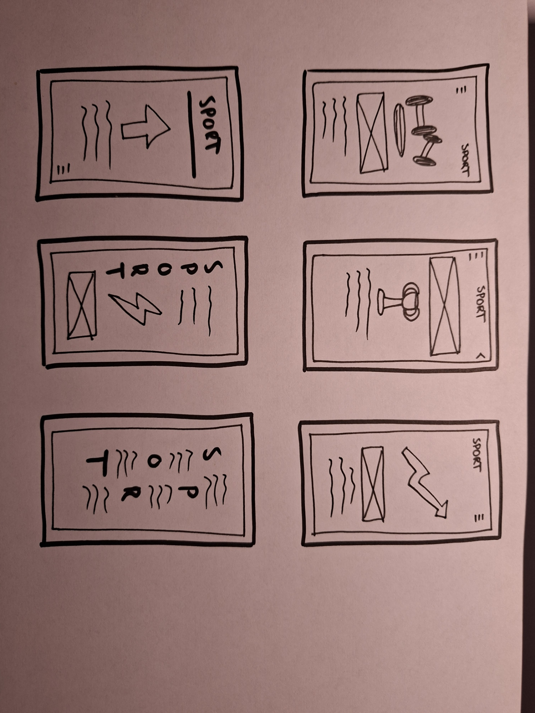

# Model

Het staat model voor digitale tuintjes welke bij 'Het web is voor iedereen' door studenten worden gemaakt.

## Learning Log

## 31 aug - Kickoff

- Een fork van de model repository gemaakt en gepubliceerd via mijn eigen Github omgeving.
- Zelftest in de les gemaakt.

### Checkout:
### Leg uit wat een source hosting platform is en voor welke jij gekozen hebt.
Een source hosting platform is een online platform waarop je je code opslaat en beheert en kan delen. Ik heb gekozen voor GitHub.

### Vertel welke domeinnaam jij gekozen hebt en hoe je die hebt gekoppeld aan jouw pagina.
Ik heb voor mijn domeinnaam mijn initialen gevolgd met -cmd.nl, dus mh-cmd.nl. Niet heel bijzonder, maar werkt wel :)

### Beschrijf hoe je aanpassingen aan jouw pagina kunt maken en hoe je er voor zorgt dat die op het web gepubliceerd worden.
Met HTML en CSS kan je aanpassingen aanbrengen op je webpagina met een code editor, VScode. HTML gebruik je om de opmaak van je website op te bouwen en CSS om je opmaak naar wens te stylen.

## 2 sept - Deepdives

### Interactie: MMD, micro-interacties, forms (Nicky)
- In de les hebben we (oude) ontwerpprincipes weer opgehaalt en dit toegeppast met een passende opdracht.

### CSS: fonts met kleur en effecten (Sanne)
- We hebben uitleg gekregen wat er allemaal mogelijk is met fonts en wat de beste manier is om fonts te gebruiken en toe te passen. Vervolgens een paar opdrachten gedaan.

## 4 sept - Deepdives

### Typografie (Diederik)
- Ik kon niet bij deze dag zijn dus heb thuis het huiswerk en de opdrachten gedaan.

### chetsen van o.a. interactie en animatie (Charley)
- Ook voor de schets deep dive heb ik de oefeningen gemaakt.

## 7 sept - verkenning

### Opdracht 1:

**Naam van de website: madewithtea.com**

_Wel fluïde/adaptief want_ het scherm past zich aan op verschillende groottes. Er zit ook een duidelijke hiërarchie in de website met koppen en stukjes.

_Wel interactief/dynamisch want_ knoppen hebben hover states en de website is heel makkelijk en overzichtelijk in gebruik.

_Wel toegankelijk want_ de website houdt een vaste en duidelijke huisstijl aan dat goed samenkomt en mooi oogt. Die hiërarchie is goed door het gebruik van koppen met verschillende lettertypen, kleuren en diktes. Je kan hem ook bedienen met je toetsenbord.

_Niet volwassen want_ zover ik weet wordt er geen data opgeslagen 

_Wel expressief want_ ook al zitten er niet veel animaties in is de website wel goed vormgegeven. Een website heeft niet altijd animaties of interacties nodig wil je de boodschap of je stijl overbrengen. In dit geval is de website heel minimalistisch en simpel, wat hem gelijk ook weer 'webby' maakt. De website oogt visueel heel duidelijk en heeft een sterk contrast.

_Wel verassend want_ hij introduceert toch nog goed zichzelf achter deze website. Hij is niet heel persoonlijk, omdat de website vrij standaard is en er weinig personaliteit aan is gegeven, maar dat kan bij deze persoon misschien heel goed werken. Ikzelf ben ook fan van minimalistische designs.

**Naam van de website: edwinwenink.xyz**

_Wel fluïde/adaptief want_ het scherm past zich aan op het formaat. De knoppen zijn ook makkelijk te bedienen.

_Wel interactief/dynamisch want_ knoppen hebben een duidelijke hover state en je kan ook zien dat je scrolt.

_Wel toegankelijk want_ er is genoeg contrast. Ook kan je de website bedienen met je toetsenbord. De knoppen zijn duidelijk en hebben een eigen stijl.

_Niet volwassen want_ ik zie niets over opgeslagen informatie.

_Wel expressief want_ de maker heeft een heel unieke eigen stijl. Dat er ouderwets en tech-achtig uitziet. Ook is de stijl goed doorgevoerd op de andere pagina's. Met duidelijk koppen en informatie.

_Wel verassend want_ ik zou zelf niet zo'n website maken, maar vind het leuk en mooi om te zien. Zijn gekozen stijl maakt de website heel 'webby'.

### Opdracht 2:

Ik vind de eerste website die ik heb geannalyseerd heel mooi vormgegeven. Aangezien ik zelf ook mezelf in deze stijl herken ga ik me ook laten inspireren met deze stijl voor mijn eigen garden. Ik wil er net wat meer mijn eigen personaliteit en draai aangeven en hem wellicht wat meer opfleuren en hem zo mijn eigen maken.

Ik kan dan mijn ervaringen, hobby's en interesses vormgeven op de website, alles wat mij als persoon vormgeeft. Zodat de lezer mij kan leren kennen en in een oogopslag kan zien. Dit denk ik vooral te doen met tekst en afbeeldingen/illustraties. 

### Opdracht 3:
Als onderwerp heb ik gekozen voor sport. Er gaat namelijk best wat van mijn tijd in sport en dit doe ik alleen of met vrienden. Ik vind het een leuke bezigheid in mijn vrije tijd wat mij uitdaagd en het is een moment waarin ik mijn focus ergens anders op kan richten. Daarom leek dit onderwerp mij leuk en perfect om hiermee aan de slag te gaan.

Ik heb zoveel mogelijk foto's omtrent sport proberen te verzamelen. Zoals het uiterlijk van sport, daarbij dacht ik aan gebouwen, apparatuur, kleding en de activiteiten. Ook wat er bij sport komt kijken, zoals de persoonlijke behaalde prestaties, maar daar hoort natuurlijk ook voeding en discipline bij. Al deze vormen heb ik geprobeerd te visualiseren en samen te brengen naar een geheel.

Veel voorkomende kleuren zijn dan ook donker, zoals grijs en zwart. Dit is namelijk typerend voor sport apparatuur en bij discipline/consistentie is zwart een veel gekozen kleur. Ik denk omdat het emotieloos is en vooral gaat het om het doelgerichte aspect. Daar passen kleuren als wit en zwart heel goed bij. Andere kleuren zoals bij voeding is dan weer heel kleurrijk, omdat gezond en natuurlijk voedsel heel gevarieerd is. Als subcultuur is het dan ook vooal de sportcultuur en mensen die zichzelf willen verbeteren en gezond willen blijven.

### Checkout:
### Leg uit wat een digital garden is en waarom dat anders is dan een reguliere website.
Een digital garden is een website waarin jij je eigen plekje hebt met hobby's/interesses of wat jij allemaal kan. Deze is bij iedereen uniek.

### Leg uit wat een website 'webby' maakt en welke websites jou het meeste inspireren.
Websites met webby aspecten hebben vooral herkenbare elementen waarbij iedereen dat kan ascociëren met het internet. Bijvoorbeeld een retro achtige stijl.

### Vertel waar jij mee aan de slag wilt gaan bij het maken van jouw eigen digital garden (let op: dit zijn jouw eerste ideeën, dit kan en mag veranderen in de loop van het programma.
Ik wil me richten op mijn hobby sport. Ik vind het een leuke en uitdagende bezigheid.

- Presentatie gemaakt over onderwerp

## 9 sept
### Opdracht 5:
Ter voorbereiding kies je eerst sfeerwoord(en) die dient als uitgangspunt voor je visueel onderzoek. Een sfeerwoord kun je afleiden door de zin af te maken:
'ik voel mij sterk'. 

Ik heb voor dit woord gekozen, omdat het meerdere betekenissen kan hebben. Je kan je bijvoorbeeld fysiek, maar ook mentaal sterk voelen. Ook voel je je goed als je je sterk voelt. Dit woord heeft dus verschillende voordelen wat te maken heeft met sporten.

### Opdracht 6:
Positiviteit zie ik vooral terug in de afbeeldingen en zelfvertrouwen. Dat zijn allemaal gevolgen van het sporten wat weer te maken heeft met mijn sfeerwoorden.

Een lach of een gefocust gezicht kan doorzettingsvermogen uitbeelden. Sporten gaat als een soort domino wat uitkomt bij jezelf goed voelen.

### Opdracht 7:
De gevonden posters vind ik heel goed bij mijn onderwerp en woorden passen. Ze zijn robuust, energiek, maar ook soms vloeiend. De kleuren zijn ook heel passend voor sport of discipline, denk aan zwart en wit.

### Opdracht 8

### Opdracht 9

### Opdracht 11

### Checkout:
### Leg uit waar het Visual Research in 3 stappen naartoe werkt
Met visual research kom je achter de visuele ontwerpkeuzes van je onderwerp. Dit doe je op een onderzoekende manier met andere bronnen, zodat je op iets unieks komt.

### Vertel in 2 zinnen waar jouw Garden over gaat, en met welke content je dat gaat doen (beeld, tekst, sound, animatie enz).
Mijn garden gaat over sport. Dit ga ik doen met beeld en tekst.

### Vertel kort welk idee van de Crazy 8 je het liefst zou willen uitvoeren/ verder zou willen onderzoeken
Dat is nog even uitzoeken. visualisaties vind ik wel leuk en passend dus ga daar zeker verder mee experimenteren.