# Model

Het staat model voor digitale tuintjes welke bij 'Het web is voor iedereen' door studenten worden gemaakt.

## Learning Log

## 31 aug - Kickoff

- Een fork van de model repository gemaakt en gepubliceerd via mijn eigen Github omgeving.
- Zelftest in de les gemaakt.

### Checkout:
### Leg uit wat een source hosting platform is en voor welke jij gekozen hebt.
Een source hosting platform is een online platform waarop je je code opslaat en beheert en kan delen. Ik heb gekozen voor GitHub.

### Vertel welke domeinnaam jij gekozen hebt en hoe je die hebt gekoppeld aan jouw pagina.
Ik heb voor mijn domeinnaam mijn initialen gevolgd met -cmd.nl, dus mh-cmd.nl. Niet heel bijzonder, maar werkt wel :)

### Beschrijf hoe je aanpassingen aan jouw pagina kunt maken en hoe je er voor zorgt dat die op het web gepubliceerd worden.
Met HTML en CSS kan je aanpassingen aanbrengen op je webpagina met een code editor, VScode. HTML gebruik je om de opmaak van je website op te bouwen en CSS om je opmaak naar wens te stylen.

## 2 sept - Deepdives

### Interactie: MMD, micro-interacties, forms (Nicky)
- In de les hebben we (oude) ontwerpprincipes weer opgehaalt en dit toegeppast met een passende opdracht.

### CSS: fonts met kleur en effecten (Sanne)
- We hebben uitleg gekregen wat er allemaal mogelijk is met fonts en wat de beste manier is om fonts te gebruiken en toe te passen. Vervolgens een paar opdrachten gedaan.

## 4 sept - Deepdives

### Typografie (Diederik)
- Ik kon niet bij deze dag zijn dus heb thuis het huiswerk en de opdrachten gedaan.

### chetsen van o.a. interactie en animatie (Charley)
- Ook voor de schets deep dive heb ik de oefeningen gemaakt.

## 7 sept - verkenning

### Opdracht 1:

**Naam van de website: madewithtea.com**

_Wel fluïde/adaptief want_ het scherm past zich aan op verschillende groottes. Er zit ook een duidelijke hiërarchie in de website met koppen en stukjes.

_Wel interactief/dynamisch want_ knoppen hebben hover states en de website is heel makkelijk en overzichtelijk in gebruik.

_Wel toegankelijk want_ de website houdt een vaste en duidelijke huisstijl aan dat goed samenkomt en mooi oogt. Die hiërarchie is goed door het gebruik van koppen met verschillende lettertypen, kleuren en diktes. Je kan hem ook bedienen met je toetsenbord.

_Niet volwassen want_ zover ik weet wordt er geen data opgeslagen 

_Wel expressief want_ ook al zitten er niet veel animaties in is de website wel goed vormgegeven. Een website heeft niet altijd animaties of interacties nodig wil je de boodschap of je stijl overbrengen. In dit geval is de website heel minimalistisch en simpel, wat hem gelijk ook weer 'webby' maakt. De website oogt visueel heel duidelijk en heeft een sterk contrast.

_Wel verassend want_ hij introduceert toch nog goed zichzelf achter deze website. Hij is niet heel persoonlijk, omdat de website vrij standaard is en er weinig personaliteit aan is gegeven, maar dat kan bij deze persoon misschien heel goed werken. Ikzelf ben ook fan van minimalistische designs.

**Naam van de website: edwinwenink.xyz**

_Wel fluïde/adaptief want_ het scherm past zich aan op het formaat. De knoppen zijn ook makkelijk te bedienen.

_Wel interactief/dynamisch want_ knoppen hebben een duidelijke hover state en je kan ook zien dat je scrolt.

_Wel toegankelijk want_ er is genoeg contrast. Ook kan je de website bedienen met je toetsenbord. De knoppen zijn duidelijk en hebben een eigen stijl.

_Niet volwassen want_ ik zie niets over opgeslagen informatie.

_Wel expressief want_ de maker heeft een heel unieke eigen stijl. Dat er ouderwets en tech-achtig uitziet. Ook is de stijl goed doorgevoerd op de andere pagina's. Met duidelijk koppen en informatie.

_Wel verassend want_ ik zou zelf niet zo'n website maken, maar vind het leuk en mooi om te zien. Zijn gekozen stijl maakt de website heel 'webby'.

### Opdracht 2:

Ik vind de eerste website die ik heb geannalyseerd heel mooi vormgegeven. Aangezien ik zelf ook mezelf in deze stijl herken ga ik me ook laten inspireren met deze stijl voor mijn eigen garden. Ik wil er net wat meer mijn eigen personaliteit en draai aangeven en hem wellicht wat meer opfleuren en hem zo mijn eigen maken.

Ik kan dan mijn ervaringen, hobby's en interesses vormgeven op de website, alles wat mij als persoon vormgeeft. Zodat de lezer mij kan leren kennen en in een oogopslag kan zien. Dit denk ik vooral te doen met tekst en afbeeldingen/illustraties. 

### Opdracht 3:
Als onderwerp heb ik gekozen voor sport. Er gaat namelijk best wat van mijn tijd in sport en dit doe ik alleen of met vrienden. Ik vind het een leuke bezigheid in mijn vrije tijd wat mij uitdaagd en het is een moment waarin ik mijn focus ergens anders op kan richten. Daarom leek dit onderwerp mij leuk en perfect om hiermee aan de slag te gaan.

Ik heb zoveel mogelijk foto's omtrent sport proberen te verzamelen. Zoals het uiterlijk van sport, daarbij dacht ik aan gebouwen, apparatuur, kleding en de activiteiten. Ook wat er bij sport komt kijken, zoals de persoonlijke behaalde prestaties, maar daar hoort natuurlijk ook voeding en discipline bij. Al deze vormen heb ik geprobeerd te visualiseren en samen te brengen naar een geheel.

Veel voorkomende kleuren zijn dan ook donker, zoals grijs en zwart. Dit is namelijk typerend voor sport apparatuur en bij discipline/consistentie is zwart een veel gekozen kleur. Ik denk omdat het emotieloos is en vooral gaat het om het doelgerichte aspect. Daar passen kleuren als wit en zwart heel goed bij. Andere kleuren zoals bij voeding is dan weer heel kleurrijk, omdat gezond en natuurlijk voedsel heel gevarieerd is. Als subcultuur is het dan ook vooal de sportcultuur en mensen die zichzelf willen verbeteren en gezond willen blijven.

### Checkout:
### Leg uit wat een digital garden is en waarom dat anders is dan een reguliere website.
Een digital garden is een website waarin jij je eigen plekje hebt met hobby's/interesses of wat jij allemaal kan. Deze is bij iedereen uniek.

### Leg uit wat een website 'webby' maakt en welke websites jou het meeste inspireren.
Websites met webby aspecten hebben vooral herkenbare elementen waarbij iedereen dat kan ascociëren met het internet. Bijvoorbeeld een retro achtige stijl.

### Vertel waar jij mee aan de slag wilt gaan bij het maken van jouw eigen digital garden (let op: dit zijn jouw eerste ideeën, dit kan en mag veranderen in de loop van het programma.
Ik wil me richten op mijn hobby sport. Ik vind het een leuke en uitdagende bezigheid.

- Presentatie gemaakt over onderwerp

## 9 sept
### Opdracht 5:
Ter voorbereiding kies je eerst sfeerwoord(en) die dient als uitgangspunt voor je visueel onderzoek. Een sfeerwoord kun je afleiden door de zin af te maken:
'ik voel mij sterk'. 

Ik heb voor dit woord gekozen, omdat het meerdere betekenissen kan hebben. Je kan je bijvoorbeeld fysiek, maar ook mentaal sterk voelen. Ook voel je je goed als je je sterk voelt. Dit woord heeft dus verschillende voordelen wat te maken heeft met sporten.

### Opdracht 6:
Positiviteit zie ik vooral terug in de afbeeldingen en zelfvertrouwen. Dat zijn allemaal gevolgen van het sporten wat weer te maken heeft met mijn sfeerwoorden.

Een lach of een gefocust gezicht kan doorzettingsvermogen uitbeelden. Sporten gaat als een soort domino wat uitkomt bij jezelf goed voelen.

### Opdracht 7:
De gevonden posters vind ik heel goed bij mijn onderwerp en woorden passen. Ze zijn robuust, energiek, maar ook soms vloeiend. De kleuren zijn ook heel passend voor sport of discipline, denk aan zwart en wit.
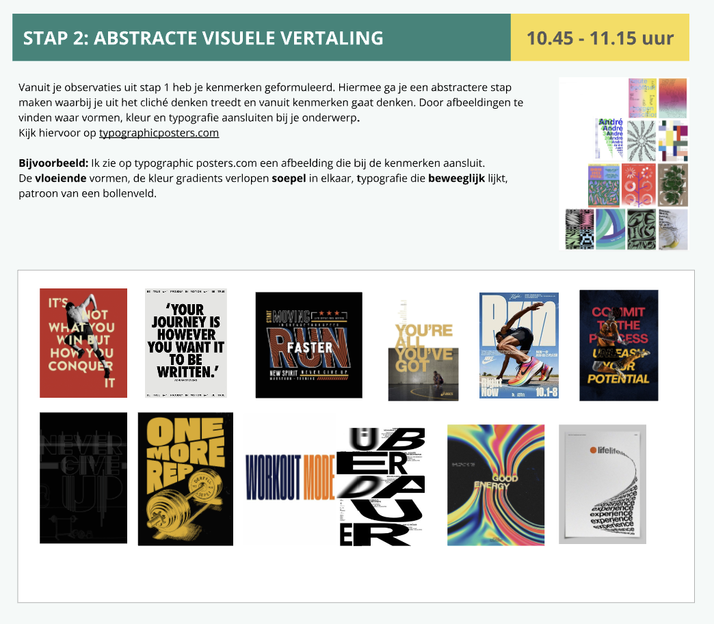

### Opdracht 8

### Opdracht 9

### Opdracht 11

### Checkout:
### Leg uit waar het Visual Research in 3 stappen naartoe werkt
Met visual research kom je achter de visuele ontwerpkeuzes van je onderwerp. Dit doe je op een onderzoekende manier met andere bronnen, zodat je op iets unieks komt.

### Vertel in 2 zinnen waar jouw Garden over gaat, en met welke content je dat gaat doen (beeld, tekst, sound, animatie enz).
Mijn garden gaat over sport. Dit ga ik doen met beeld en tekst.

### Vertel kort welk idee van de Crazy 8 je het liefst zou willen uitvoeren/ verder zou willen onderzoeken
Dat is nog even uitzoeken. visualisaties vind ik wel leuk en passend dus ga daar zeker verder mee experimenteren.

## 11 sept

### Opdracht 12:
### Voortgangsgesprek
Met Nicky in de les in een groepje elkaars onderwerp besproken en bekeken. Wat we van plan zijn en hoe we dit willen realiseren, doormiddel van de schetsen en visual research. Mijn feedback was:
- Waarmee beginnen? > homepagina/intropagina 
- Quote beginnen met content die je hebt heel sterk
- Bewegende letters uitdagend en interessant
- Content boven en onder gaaf
- Visualisaties gaaf
- Bedenk je quote

**Brainstorm quotes:**
- Everyday is a chance to be better
- dreams have no limits
- push through and you wil get it
- imagine your potential if you gave it all
- build you strength 
- discipline beats motivation
- the older version of you will be gratefull
- best time was yesterday, second best time is now
- invest in your future
- make it happen
- consistency is all it takes
- be the best version of yourself
- make your younger self proud
- make the child in you proud
- doing is better than not doing
- the only limit is you
- just show up
- progress takes time

**Feedback Charley:**
- wat roept de geassocieerde emotie(s) bij de posters op? waarom zijn sommige kleuren bijvoorbeeld emotieloos of hoe maakt het de poster motiverend/bewegend?
- gebruik en herken dit zodat je het kan toepassen in je eigen ontwerp
- gebruik de deepdives om de theorie en opdrachten toe te passen die aansluiten bij je quotes

Dit hebben we verolgens besproken dat er meer te associëren is met de posters en wat de redenen zijn waarom ze die bepaalde gevoelens en/of opvattingen opwekken.

Bijvoorbeeld dat er vooral gebruik wordt gemaakt van capitale letters, een duidelijk contrast (wit-zwart/geel-zwart), gecentreerde tekst, grote tekst, dikke tekst. Maar ook schuine tekst dat perspectief creëert en letters die buiten de poster vallen die ook weer beweging nabootsen. Het herkennen van deze ontwerptechnieken maken het gemakkelijker om dit toe te passen voor eigen ideëen en ontwerpen die horen bij mijn onderwerp.

### Checkout:
### Welkke feedback heb je gehad?
Ik heb verschillende feedback gehad. Van Nicky over mijn ontwerp en ideëen over mijn onderwerp, zoals wat ik kan doen met sport en hoe ik dit het beste kan aanpakken. En met Charley over de opvattingen en denkwijze van mijn visual research, zodat ik deze manieren het beste kan toepassen en gebruiken voor mijn eigen ontwerp.

## ma 14 sept

### Bi-weekly geek
Als voorbereiding heb ik de artikelen bekeken en gelezen. Het filmpje ging vooral over hoe het internet werkt als geheel over de hele wereld. Wat er nodig is voor het verzenden en ontvangen van berichtjes en dat dit allemaal wordt opgeslagen in gigantische data centers. De artikelen gingen over specifiekere gedeeltes van het internet, namelijk wat gebeurt er als grote tech bedrijven de macht hebben over (onze) data en Tim Berners-Lee zijn kijk over het world wide web als bedenker zijnde. In de les hebben we deelvragen opgesteld in groepjes en van een andere groep de onderzoeksmethodes aan gekoppeld.

### Color palatte en font-family
Ik wil verder met het realiseren van mijn tuintje. Het leek mij daarbij passend om een color palatte en font-fmaily uit te zoeken die bij mij en mijn tuintje past. Ik ben op zoek naar kleuren die minimalistisch zijn en kleuren die passen bij sport/krachttraining. Om deze kleuren te vinden kijk ik nog eens naar mijn visual research wat daarin opvalt ter inspiratie. Kleuren die bij dit onderwerp passen doen mij denken aan:

- minimalisme
- kracht
- sportiviteit
- discipline
- motivatie
- zelfontwikkeling

Wat mij opvalt uit mijn eerdere visual research is dat kleuren die horen bij motivatie en sport heel strakke en simpele kleuren zijn, dus niet te druk en niet teveel. Vooral tinten van wit, grijs en zwart en dat samen met een vaste kleur, zoals groen, rood, blauw, geel, etc. Color palattes die hierbij aansluiten die ik heb gevonden zijn:

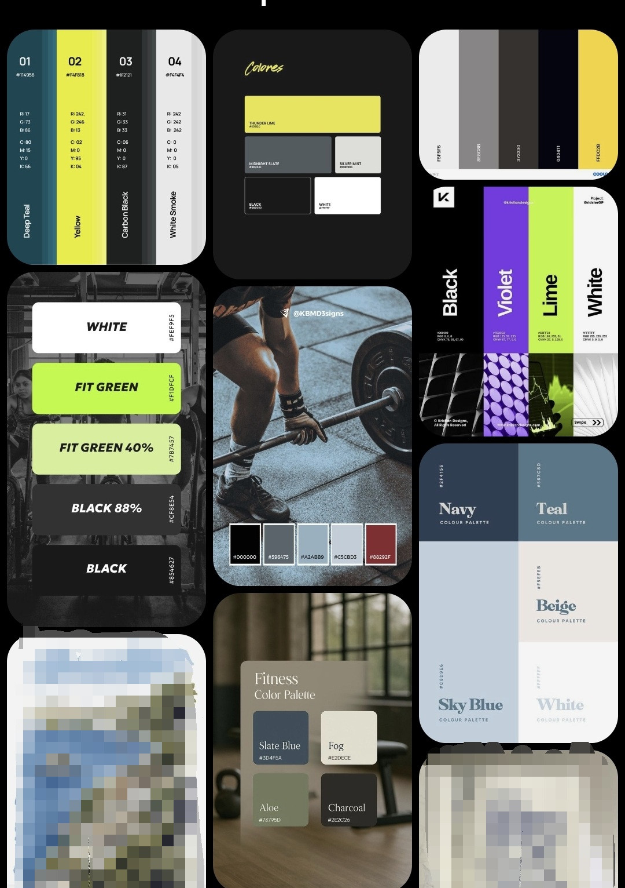

Wat ik mooi vind aan deze palattes is dat ze mooi samenkomen en vooral ook een sterke contrast hebben wat belangrijk is, want dat kwam naar voren uit mijn visual research. Ik heb verschillende palletes gevonden die met elkaar te maken hebben. Elke palatte bevat een vorm van wit en zwart en met verschillende aparte kleuren. Groen staat vooral voor positiviteit en groei, maar ben zelf niet zo'n grote fan van een fel groene kleur. Deze kleur geeft me ook eerder een associatie met tennis, gezien dezelfde kleur groen als bij een tennisbal. Rood en paars kunnen daarnaast staan voor kracht/discipline en geel vind ik echt een energieke scherpe kleur.  

De kleuren van mijn tuintje moeten ook weer niet te explosief zijn, omdat dit anders geassocieerd kan worden met actievere sport, zoals hardlopen wat je ook vaak ziet terugkomen in hun kleding. Mensen die liften dragen simpelere kleding in de sportschool en dat kan je ook terug zien aan de afbeeldingen uit mijn visualresearch. De tweede palatte heeft hierin vind ik de beste balans, dus zal ik deze gebruiken.

Voor de lettertype zoek ik een robuuste, goede captiale en schreefloze lettertype. Maar lijkt het mij ook leuk om een tweede lettertype te gebruiken die een beetje techy/webby/sportief is om wat meer personaliteit in de website te brengen. Daarvoor gebruik ik 'Chamfer Gothic Ludlow' en als standaard tekst vond ik de tweede lettertype 'Barlow' daar mooi bij passen. Helaas kon ik uit adobe fonts niet de fonts downloaden, Barlow stond gelukkig wel op Google Fonts om te downloaden maar chamfer niet, dus heb Big Shoulders Stencil als vervanger.
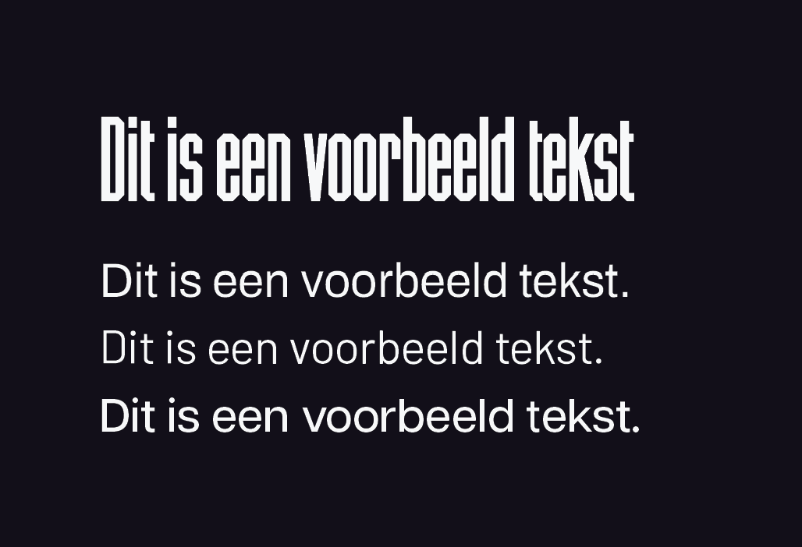

## Checkout
### Leg uit wanneer een website 'lelijk' wordt en geef voorbeelden wat je kan doen om deze 'lelijke' onderdelen te fixen?
Door responsivness toe te voegen en dat alles goed is uitgelijnd op alle scherm formaten, zodat je website goed leesbaar blijft. Verschillende letter grootte en plaatjes, dus niet te groot en niet te klein zorg dat het goed leesbaar is met duidelijke hiërarchie.

### Vertel welke volgende stap je neemt om je website responsive te maken.
Door de main een max-width te geven.

### Kun je het ontwerp en de bouw van je eigen Garden (zo uit je hoofd) onderbouwen in Webby vocabulair?
Door alles goed te verdelen in html-tags, dus headers verdelen in h1, h2, etc.

## ma 14 spet - vr 18 sept
In deze periode heb ik mij gericht op het afmaken van mijn digital garden. Aan de hand van mijn schetsen en kleuren palatte heb ik deze samengesteld. Ik heb de schetsen opgesteld van mijn homepagina en ben hiermee als eerste begonnen. 

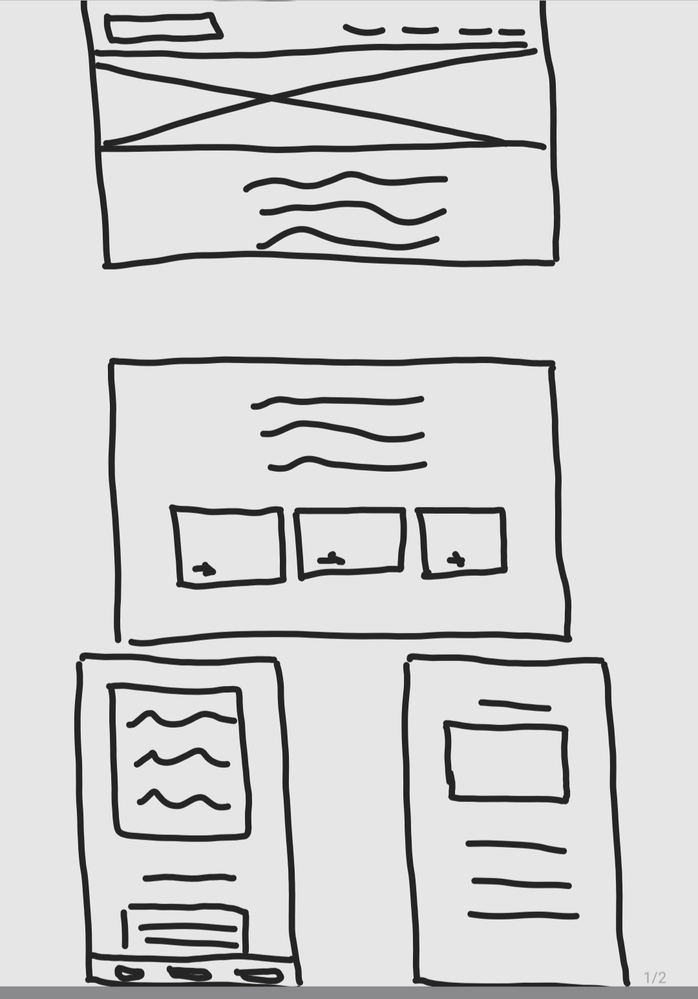

Zoals ik eerder had besproken wilde ik per onderwerp een aparte pagina. Deze heb ik gezet in de navbar en in tegels met css-grid onderaan de homepagina als extra navigatie. De quote staat mooi centraal en opvallend als introductie, gevolgd met een korte intro. Als quote heb ik 'Progress takes time', want vond dit wel een pakkende quote. Daarnaast kan een tuintje ook groeien, dus vind dat ook heel passend. Dit waren de quotes die ik had gebrainstormd: 
- Everyday is a chance to be better
- dreams have no limits
- push through and you wil get it
- imagine your potential if you gave it all
- build you strength 
- discipline beats motivation
- the older version of you will be gratefull
- best time was yesterday, second best time is now
- invest in your future
- make it happen
- consistency is all it takes
- be the best version of yourself
- make your younger self proud
- make the child in you proud
- doing is better than not doing
- the only limit is you
- just show up
- progress takes time

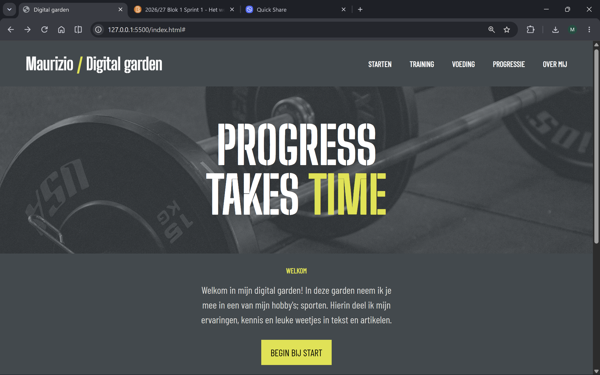

Vervolgens kan je beginnen bij de 'start' pagina, hierin geef ik een uitleg en deel ik mijn ervaring en kennis. Dan wordt je doorverwezen naar de volgende 'training', 'voeding' en 'over mij' pagina met dezelfde principe inhoud. Ook staat er een bij iedere pagina een knop waarbij je een bijhorend artikel opent.

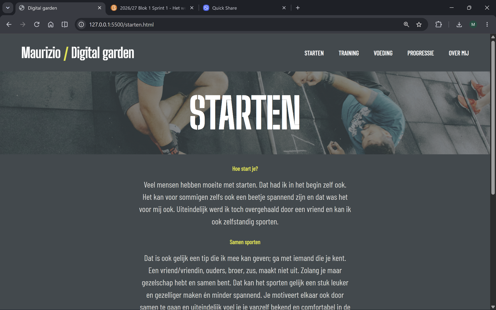
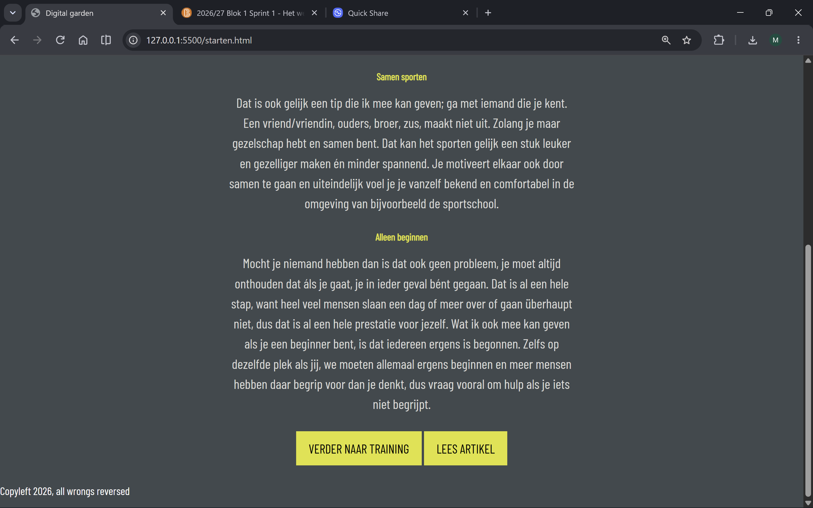

Het is me gelukt om de website helemaal te realiseren, alleen niet om hem responsive te maken/houden. Op telefoons werkt hij dus nog niet helemaal naar wens, maar op de pc versie gelukkig wel. Dat is dus ook misschien de volgende stap om hem ook helemaal goed te maken voor mobile. Het advies was om mobile-first te beginnen, maar heb dit voorheen nooit zo gedaan bij mijn oudere projecten en ben daarom dus begonnen met pc versie, omdat dit mij makkelijker afging. Ik had namelijk ook enige kennis met html en css. Zoals je kan zien heb ik voor elke pagina dezelfde styling aangehouden om de website zo consistent mogelijk te houden.

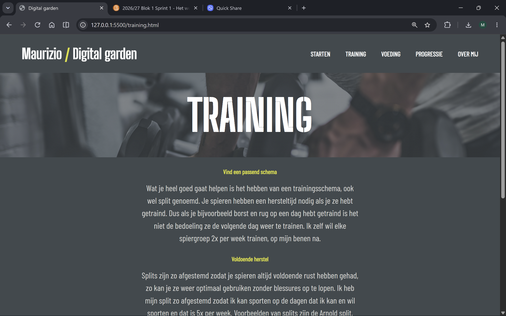
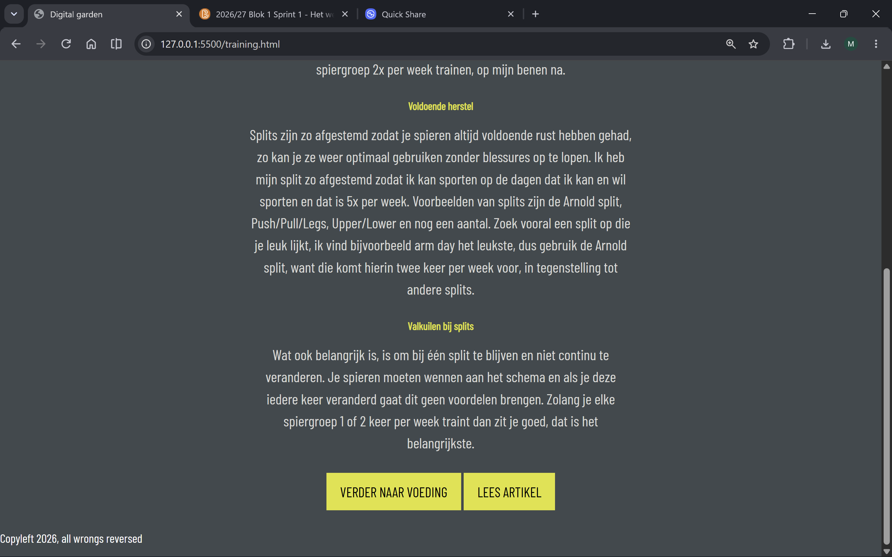
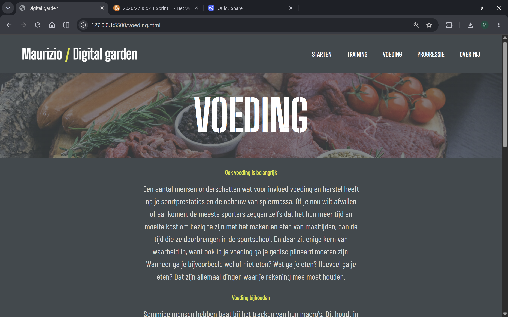
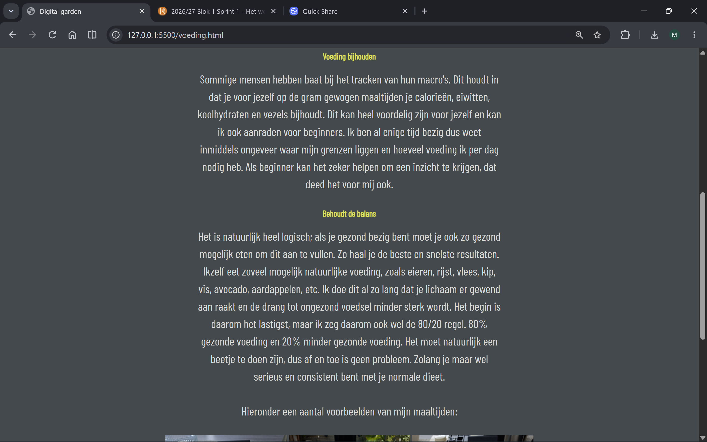
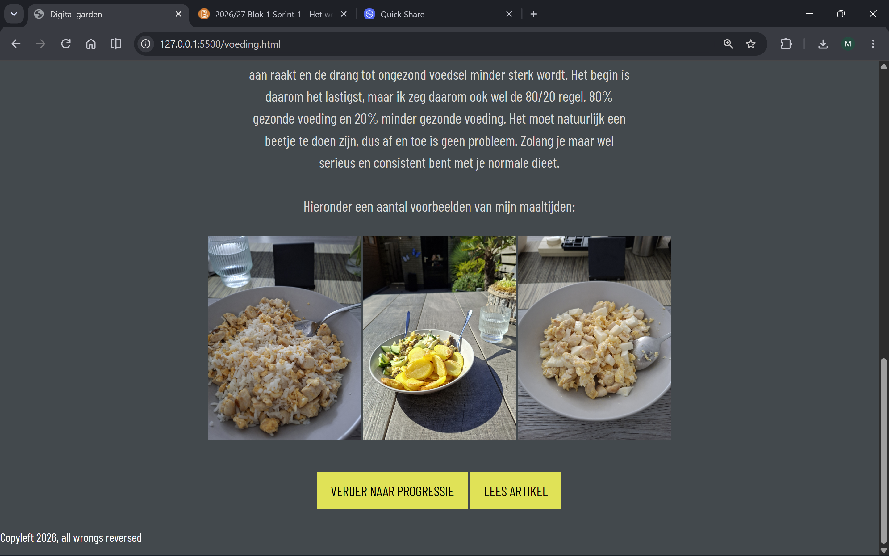
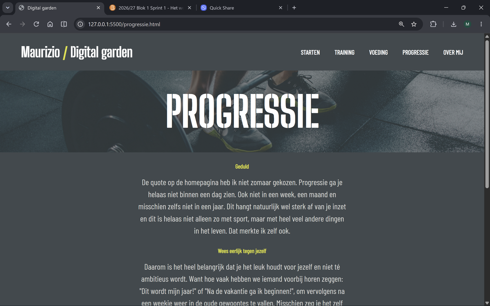
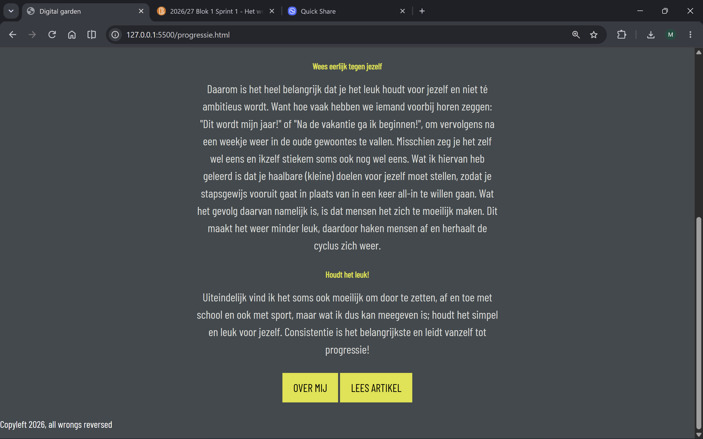
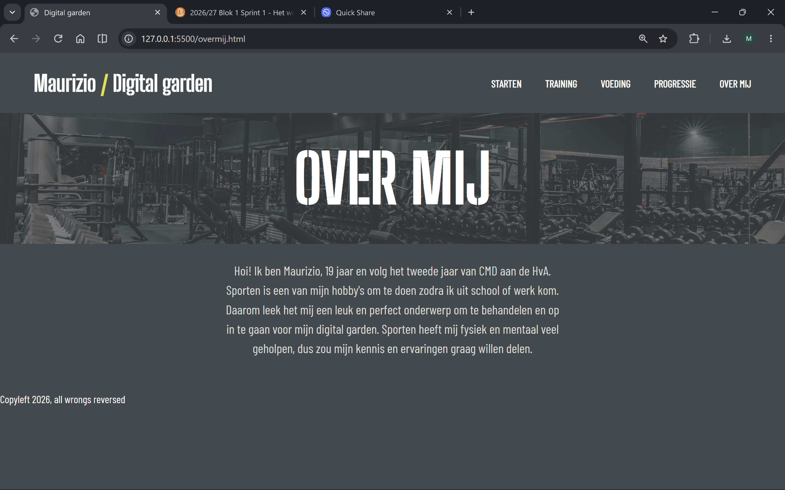

Uiteindelijk kostte het me meer tijd dan gedacht, maar ben wel heel tevreden met het eindresultaat. Dit omdat alles erin zit wat ik wilde dat erin zou moeten zitten en had ook veel plezier in het maken en schrijven van mijn garden. Ik heb het simpel proberen te houden maar tegelijkertijd ook mezelf uitgedaagd merkte ik, want heb veel nieuwe dingen geleerd. Zoals bijvoorbeeld van de deepdives interactie, schetsen, kleurgebruik en de basis van fonts, want voorheen deed ik dit blijkbaar verkeerd zonder @font-face.  