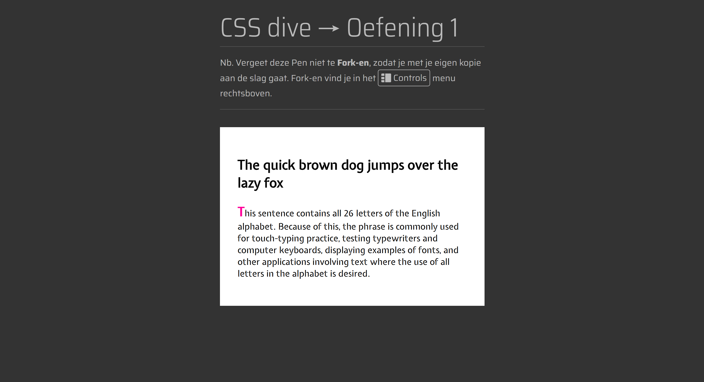
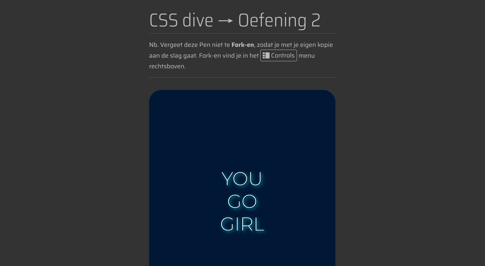

# Model

Het staat model voor digitale tuintjes welke bij 'Het web is voor iedereen' door studenten worden gemaakt.

## Learning Log

## 31 aug - Kickoff

- Een fork van de model repository gemaakt en gepubliceerd via mijn eigen Github omgeving.
- Zelftest in de les gemaakt.

### Checkout:
### Leg uit wat een source hosting platform is en voor welke jij gekozen hebt.
Een source hosting platform is een online platform waarop je je code opslaat en beheert en kan delen. Ik heb gekozen voor GitHub.

### Vertel welke domeinnaam jij gekozen hebt en hoe je die hebt gekoppeld aan jouw pagina.
Ik heb voor mijn domeinnaam mijn initialen gevolgd met -cmd.nl, dus mh-cmd.nl. Niet heel bijzonder, maar werkt wel :)

### Beschrijf hoe je aanpassingen aan jouw pagina kunt maken en hoe je er voor zorgt dat die op het web gepubliceerd worden.
Met HTML en CSS kan je aanpassingen aanbrengen op je webpagina met een code editor, VScode. HTML gebruik je om de opmaak van je website op te bouwen en CSS om je opmaak naar wens te stylen.

## 3 sept - Deepdives

### Interactie: MMD, micro-interacties, forms (Nicky)
- In de les hebben we (oude) ontwerpprincipes weer opgehaalt en dit toegeppast met een passende opdracht.

### CSS: fonts met kleur en effecten (Sanne)
- We hebben uitleg gekregen wat er allemaal mogelijk is met fonts en wat de beste manier is om fonts te gebruiken en toe te passen. Vervolgens een paar opdrachten gedaan.

